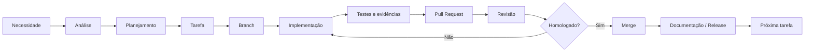

<div align="center">

# Método ÓRBITA

### Desenvolvimento de Software Assistido por IA com Governança Humana

**Um modelo prático de organização, rastreabilidade e controle do desenvolvimento de software assistido por IA.**


</div>

---

## Como funciona

O ÓRBITA parte de uma ideia simples: **o desenvolvimento assistido por IA funciona melhor quando cada parte do trabalho tem um papel e um lugar definidos**.

O objetivo é evitar que o projeto exista apenas dentro de uma conversa ou que a implementação avance sem contexto suficiente para ser compreendida depois. Um projeto bem organizado deve permitir retomar o trabalho dias ou semanas depois e entender com clareza **o que está sendo construído, por que certas decisões foram tomadas, o que já foi concluído, o que ainda falta e qual é o próximo passo**.

Por isso, cada software é tratado como um projeto coerente entre os ambientes usados para planejá-lo, implementá-lo e registrá-lo. Sempre que possível, esses ambientes usam **o mesmo nome**.

Na prática:

- **o agente de planejamento** ajuda a compreender o problema, planejar, revisar e administrar o projeto;
- **o agente de implementação** trabalha na implementação e nas validações técnicas;
- **a pasta local** contém a working copy do software;
- **o GitHub** mantém o registro persistente do código, da documentação e da evolução do projeto;
- **o responsável humano** mantém decisões, prioridades e homologação.

Esses espaços não competem entre si. Eles se complementam.

### Configuração de referência

Na configuração usada como referência neste repositório, **ChatGPT** atua como agente de planejamento e **Codex** como agente de implementação. Essa combinação é apenas um exemplo de aplicação, não uma exigência do ÓRBITA.

Quem adotar o método pode usar **Claude, Gemini ou qualquer outra IA/agente** capaz de cumprir esses papéis. Também é possível trocar as ferramentas ao longo do tempo sem alterar o método, desde que as responsabilidades, a rastreabilidade e os gates permaneçam claros.

A eficiência do modelo não vem de entregar tudo para a IA. Ela vem de **reduzir ambiguidade**: cada agente sabe qual é o seu papel, cada projeto possui um lugar definido, as mudanças são pequenas o suficiente para serem acompanhadas e o conhecimento importante volta para o repositório em vez de desaparecer dentro de uma conversa.

É isso que o ÓRBITA procura preservar: **usar a velocidade da IA sem perder organização, entendimento e controle humano.**

## Visão geral

O **Método ÓRBITA** é uma sistematização prática para manter projetos de software assistidos por Inteligência Artificial **organizados, rastreáveis e sob governança humana**.

Ele nasceu de uma necessidade prática: usar agentes de IA para aumentar capacidade de análise e implementação sem perder clareza sobre **quem decide, quem planeja, quem executa, o que foi alterado e quando uma etapa pode realmente ser considerada concluída**.

O modelo não pretende substituir metodologias consolidadas de engenharia de software nem reivindicar ineditismo sobre práticas já conhecidas. Ele organiza Git, branches, commits, Pull Requests, testes, documentação e desenvolvimento incremental em um fluxo com separação explícita de responsabilidades entre humano e agentes de IA.

> **Princípio central:** Planejar → Executar → Evidenciar → Homologar.

## Motivação

Ferramentas de IA conseguem produzir código rapidamente. O problema é que velocidade sem processo pode gerar outro tipo de dívida: decisões implícitas, alterações difíceis de rastrear, escopo crescente, documentação desatualizada e perda de compreensão do próprio projeto.

O ÓRBITA foi criado para evitar isso.

No ÓRBITA, a IA **não recebe autoridade irrestrita sobre o projeto**. Cada participante possui um papel definido, o trabalho é dividido em unidades controláveis e mudanças importantes dependem de evidências e homologação.

## Identidade do projeto

Na aplicação prática atual do ÓRBITA, cada software recebe uma identidade coerente nos ambientes usados para desenvolvê-lo:

| Espaço | Organização esperada | Função principal |
|---|---|---|
| **Contexto do agente de planejamento** | projeto/conversa/workspace próprio com o nome do software | planejamento, análise, decisões, coordenação e revisão |
| **Contexto do agente de implementação** | projeto/workspace próprio com o mesmo nome | implementação, testes e produção de evidências |
| **Pasta local** | pasta com o mesmo nome do projeto | working copy do Git, arquivos locais e execução técnica |
| **Repositório GitHub** | repositório correspondente ao mesmo projeto | fonte persistente da verdade, histórico e documentação |

A regra prática é:

> **um projeto → um nome reconhecível → um contexto próprio em cada ferramenta → um repositório canônico.**

Essa padronização reduz trocas de contexto, nomes divergentes, uso acidental do repositório errado e perda de continuidade entre planejamento e implementação.

O GitHub continua sendo a fonte persistente da verdade. Os ambientes dos agentes de planejamento e implementação são contextos de trabalho; a pasta local é a working copy sincronizada com o repositório remoto.

A especificação completa está em [Identidade e ambiente do projeto](docs/10-IDENTIDADE-E-AMBIENTE-DO-PROJETO.md).

## Inicialização de um projeto

A organização começa **antes da primeira linha de código**.

O responsável humano cria um contexto dedicado no agente de planejamento, inicia a conversa, apresenta a ideia e informa dois repositórios: o do Método ÓRBITA e o repositório remoto reservado ao novo software.

A partir daí, o fluxo inicial é:

```text
Contexto do agente de planejamento
        ↓
ideia + Método ÓRBITA + repositório do projeto
        ↓
agente de planejamento entende o método e estrutura o software
        ↓
README + planejamento + documentação inicial no GitHub
        ↓
agente de planejamento confirma a fundação
        ↓
primeira tarefa: bootstrap do agente de implementação
        ↓
pasta local criada pelo responsável humano
        ↓
agente de implementação inicializa/valida Git e sincroniza com o remoto
        ↓
planejamento + implementação + pasta local + GitHub
estão vinculados ao mesmo projeto
        ↓
começa a primeira tarefa funcional
```

Esse detalhe é importante: **o agente de planejamento funda e documenta o projeto antes da implementação; o agente de implementação primeiro conecta a working copy local ao projeto já documentado; só depois começa o desenvolvimento funcional.**

A especificação está em [Inicialização de um novo projeto](docs/11-INICIALIZACAO-DE-NOVO-PROJETO.md).

## Papéis

| Elemento | Responsabilidade principal |
|---|---|
| **Responsável humano** | Define objetivos, prioridades, restrições e dá a aprovação final |
| **Agente de planejamento** | Analisa, estrutura, especifica, revisa e coordena o processo |
| **Agente de implementação** | Altera código, executa testes, builds e produz evidências técnicas |
| **Git/GitHub** | Mantém o estado canônico, histórico, documentação e rastreabilidade |

Na configuração de referência deste repositório, esses papéis correspondem a **responsável humano + ChatGPT + Codex + GitHub**. Essa combinação é apenas um exemplo de implementação; o método é independente das ferramentas específicas.

## Segurança

No ÓRBITA, segurança não é uma revisão deixada para o final. Planejamento, implementação, testes, evidências e homologação devem considerar os riscos proporcionais ao projeto.

Isso inclui segurança do software, proteção de informações, uso adequado de dados, tratamento de segredos, dependências e boas práticas de Git/GitHub.

Testes continuam sendo parte fundamental do método, mas **testes aprovados não significam ausência de vulnerabilidades**. Projetos de maior risco podem exigir validações negativas, revisão de código, análise de dependências, verificação de segredos ou revisão especializada.

A referência completa está em [Segurança e integridade do projeto](docs/12-SEGURANCA-E-INTEGRIDADE.md).

## Fluxo



## Princípios ÓRBITA

| Letra | Princípio |
|---|---|
| **O** | **Orquestração humana** |
| **R** | **Repositório como fonte da verdade** |
| **B** | **Blocos incrementais de trabalho** |
| **I** | **Implementação por agentes especializados** |
| **T** | **Testes e rastreabilidade** |
| **A** | **Aprovação antes do avanço** |

## Regras fundamentais

1. A decisão final permanece humana.
2. Planejamento e implementação são responsabilidades separáveis.
3. O trabalho avança em tarefas pequenas e verificáveis.
4. O repositório representa o estado técnico do projeto.
5. Mudanças relevantes precisam deixar evidências.
6. Código executado não é automaticamente código homologado.
7. A documentação acompanha a evolução do projeto.
8. A `main` deve representar um estado conhecido e aprovado.
9. Segurança deve ser considerada de forma proporcional ao risco durante todo o ciclo.

## Anti-padrões

O método foi desenhado para reduzir alguns padrões que podem comprometer clareza, rastreabilidade e controle no desenvolvimento assistido por IA:

- entregar um problema amplo a um agente e aceitar uma grande alteração sem decomposição;
- permitir que o mesmo agente defina, implemente e aprove sozinho a solução;
- tratar uma conversa como única fonte de documentação;
- avançar para novas funcionalidades sem homologar a etapa anterior;
- confundir “o código rodou” com “a necessidade foi atendida”;
- permitir expansão silenciosa de escopo;
- perder a relação entre requisito, implementação, evidência e decisão.

A discussão completa está em [Anti-padrões](docs/09-ANTI-PADROES.md).

## Adoção

Para aplicar o método em um novo software sem precisar reexplicar todo o processo a cada conversa, existe uma área permanente de **onboarding para agentes de IA**:

**[Começar pelo onboarding](onboarding/README.md)**

Ela define a ordem de leitura, o contrato de trabalho esperado, o checklist de início de projeto e um prompt reutilizável para apresentar o Método ÓRBITA em um novo chat.

O objetivo é permitir que um novo agente compreenda **como trabalhar** antes de receber a descrição do software e o repositório específico que será desenvolvido.

## Estudo de caso

O ÓRBITA não nasceu apenas como conceito. Seus princípios vêm sendo aplicados em projetos reais.

O primeiro estudo de caso documentado é **[Tickets Recorrentes HESK](examples/01-TICKETS-RECORRENTES-HESK.md)**. Sua representação pública está no repositório sanitizado **[hesk-recurring-tickets](https://github.com/jotaCorsino/hesk-recurring-tickets)**.

O case mostra a evolução por prova de conceito, persistência, scheduler, segurança contra duplicidade, processamento em lote, interface administrativa, implantação e operação. Cada etapa avançou por implementação, validação, evidências e homologação antes da próxima.

O projeto operacional real permanece separado da representação pública. Essa separação passou a fazer parte do próprio aprendizado do ÓRBITA: **portfólio deve expor decisões, arquitetura, processo e resultados sem exigir a exposição do ambiente operacional completo**.

## Documentação

| Documento | Conteúdo |
|---|---|
| [Visão geral](docs/01-VISAO-GERAL.md) | Origem, objetivo e escopo do modelo |
| [Princípios](docs/02-PRINCIPIOS.md) | Fundamentos que orientam o método |
| [Papéis e responsabilidades](docs/03-PAPEIS-E-RESPONSABILIDADES.md) | Quem decide, planeja, executa e registra |
| [Fluxo de desenvolvimento](docs/04-FLUXO-DE-DESENVOLVIMENTO.md) | Ciclo operacional de ponta a ponta |
| [Governança e homologação](docs/05-GOVERNANCA-E-HOMOLOGACAO.md) | Gates, evidências e critérios de avanço |
| [Git e GitHub](docs/06-GIT-E-GITHUB.md) | Uso do repositório como fonte canônica |
| [IA no método](docs/07-IA-NO-METODO.md) | Como os agentes são usados sem retirar controle humano |
| [Aplicação e evolução](docs/08-APLICACAO-E-EVOLUCAO.md) | Como adotar, adaptar e evoluir o modelo |
| [Anti-padrões](docs/09-ANTI-PADROES.md) | Comportamentos que o método procura evitar |
| [Onboarding para novos projetos](onboarding/README.md) | Entrada permanente para novos agentes e novos projetos |
| [Identidade e ambiente do projeto](docs/10-IDENTIDADE-E-AMBIENTE-DO-PROJETO.md) | Organização do mesmo projeto entre agentes, pasta local e GitHub |
| [Inicialização de um novo projeto](docs/11-INICIALIZACAO-DE-NOVO-PROJETO.md) | Fundação documental remota e primeiro bootstrap local do agente de implementação |
| [Segurança e integridade](docs/12-SEGURANCA-E-INTEGRIDADE.md) | Baseline transversal de segurança de software, informação e repositório |
| [Roadmap](ROADMAP.md) | Maturidade e próximas evoluções do próprio método |

Também existem [templates](templates/) para tarefas, bootstrap local, prompts de implementação e homologação e uma área de [exemplos](examples/) com aplicações reais.

## Objetivo do repositório

Este repositório cumpre dois objetivos.

O primeiro é **operacional**: registrar e evoluir um processo de desenvolvimento assistido por IA de forma reutilizável.

O segundo é **demonstrativo**: tornar visíveis não apenas resultados de software, mas também práticas de planejamento, governança, rastreabilidade, segurança e homologação.

## Autoria

A sistematização e a documentação do Método ÓRBITA neste repositório foram organizadas por **João Corsino**, a partir de experiência prática em projetos de software assistidos por IA.

O modelo é evolutivo e pode incorporar novas práticas conforme seu uso em projetos reais revele problemas, limitações e oportunidades de melhoria.

---

<div align="center">

**Método ÓRBITA**

*Organizar o uso da IA para que velocidade não substitua controle.*

</div>
